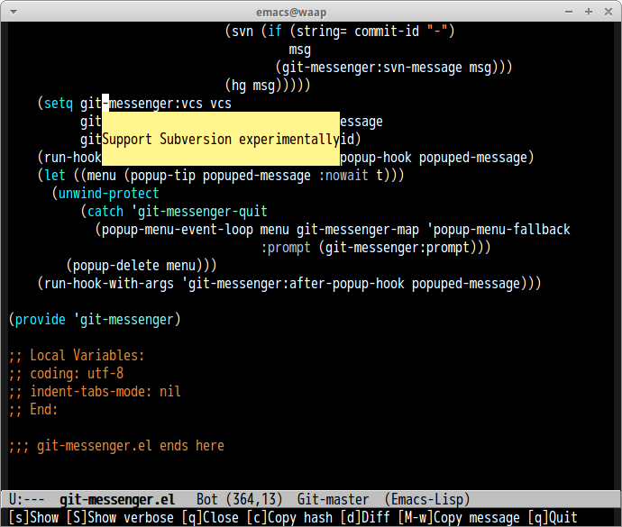

# git-messenger.el
*git-messenger.el* is Emacs port of [git-messenger.vim](https://github.com/rhysd/git-messenger.vim).

*git-messenger.el* provides function that popup commit message at current line.
This is useful when you want to know why this line was changed.


## screenshot




## Dependency

* [popup](https://github.com/auto-complete/popup-el)


## Commands

### `git-messenger:popup-message`

Pop up last commit message at current line. Show detail message, Commit ID, Author,
Date and commit message with `C-u` prefix

## Customize

### `git-messenger:show-detail`(Default `nil`)

Always show detail message if this value is `t`.

## Hooks

### `git-messenger:after-popup-hook`

Run after popup commit message. Hook function take one argument, commit message.


## Sample Configuration

```elisp
(require 'git-messenger)
(global-set-key (kbd "C-x v p") 'git-messenger:popup-message)
```
